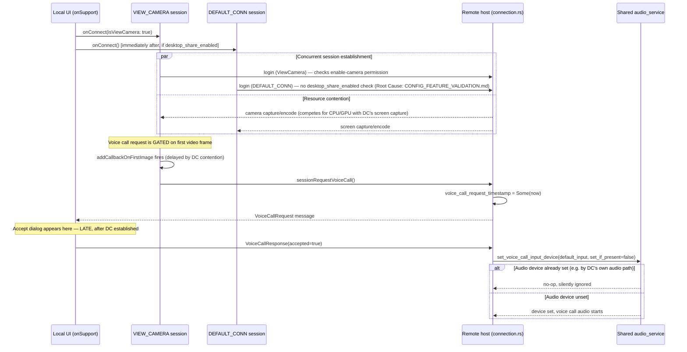

# Support Mode Audio Investigation

Source-grounded root-cause analysis of the reported symptom: **the Voice-Call accept dialog on
the remote host is delayed, sometimes appearing only after the Desktop connection is established
or after the Desktop session closes.**

Two independent, compounding root causes were found. Both prioritize reuse of upstream
mechanisms already in the codebase — no new authentication, transport, or Voice Call/VIEW_CAMERA
code exists in this fork (per ADR-0003); the issue is in *how* this fork's `onSupport()` drives
two existing upstream session types concurrently.

---

## 1. Session Startup Ordering

`connection_page.dart:120-125`:

```dart
void onSupport() {
  onConnect(isViewCamera: true);   // opens VIEW_CAMERA session
  if (_desktopShareEnabled) {
    onConnect();                   // opens a SEPARATE DEFAULT_CONN session, immediately after
  }
}
```

Both `onConnect()` calls return immediately (each opens an async session/window); there is no
`await` or ordering dependency between them. **The two sessions are established essentially
concurrently against the same remote host.**

---

## 2. Voice-Call Request Timing — Root Cause A

`view_camera_page.dart:100-118`, inside `initState()`:

```dart
_ffi.imageModel.addCallbackOnFirstImage((String peerId) {
  showKBLayoutTypeChooserIfNeeded(...);
  _ffi.recordingModel.updateStatus(...);
  // Fork: Support mode always pairs VIEW_CAMERA with a Voice Call...
  bind.sessionRequestVoiceCall(sessionId: _ffi.sessionId);
});
_ffi.start(widget.id, isViewCamera: true, ...);
```

**The Voice Call request is not sent when the VIEW_CAMERA session starts — it is deliberately
deferred until the callback fires on the session's *first decoded video frame*.** This was an
intentional, documented design choice (comment cites `docs/session-orchestration-analysis.md`
Section 9-10), but it has a side effect: **anything that delays the first camera frame also
delays the Voice Call request, and therefore delays the remote's accept dialog by the same
amount.**

If the concurrently-opened `DEFAULT_CONN` (Desktop) session is competing for the same host's
video capture/encode pipeline (CPU, GPU encoder, or simply scheduler contention from two
simultaneous capture+encode loops), the VIEW_CAMERA stream's first frame can be delayed until
that contention eases — which naturally happens once the Desktop session either finishes its own
startup (established) or ends (closed), freeing up the resources the camera stream needed. This
matches the reported symptom precisely.

---

## 3. Audio Service Ownership — Root Cause B

`src/server/audio_service.rs:49-53`:

```rust
pub fn set_voice_call_input_device(device: Option<String>, set_if_present: bool) {
    if !set_if_present && VOICE_CALL_INPUT_DEVICE.lock().unwrap().is_some() {
        return;   // <-- silently no-ops if a device is already set
    }
    ...
}
```

This is a **single, process-wide** `VOICE_CALL_INPUT_DEVICE` — not scoped per-connection. Two
call sites in `src/server/connection.rs`:

| Call site | `set_if_present` | Effect |
|---|---|---|
| `handle_voice_call(true)` (line 4367) | `false` | Sets the device **only if none is currently set** — if anything else (a prior stuck session, or contention from another connection) already populated it, this call is a silent no-op |
| `close_voice_call()` (line 4392) | `true` | **Unconditionally clears** the device to `None`, regardless of what set it or whether another active session still needs it |

**Audio routing/subscription** (`connection.rs:4376-4385`) further confirms a shared model: each
`ViewCamera` connection subscribes/unsubscribes to a single shared `audio_service::NAME` topic
based on `self.audio_enabled() && accepted` — there is no per-connection audio device isolation.

**Consequence:** if a Desktop (`DEFAULT_CONN`) session's own audio streaming and a concurrent
Voice Call both touch this shared state, two race conditions are possible:
1. The Voice Call's own `set_voice_call_input_device(default_input, false)` call can silently
   no-op if something else got there first, leaving the wrong (or no) device active for the call.
2. A `close_voice_call()` triggered by one connection unconditionally clears the shared device —
   potentially disrupting audio for an unrelated, still-active Desktop session that happens to
   also be using the same audio pipeline.

---

## 4. Sequence Diagram (Current Behavior)



---

## 5. Call Graph Summary

```
onSupport() [connection_page.dart]
├── onConnect(isViewCamera: true)
│   └── ViewCameraPage.initState() [view_camera_page.dart]
│       ├── _ffi.imageModel.addCallbackOnFirstImage(...)   <- Voice Call request deferred here
│       │   └── bind.sessionRequestVoiceCall()
│       │       └── connection.rs: message::Union::VoiceCallRequest handling (line 3633-3642)
│       │           └── voice_call_request_timestamp = Some(now)
│       └── _ffi.start(isViewCamera: true, ...)             <- triggers camera capture/encode
└── onConnect()  [if desktop_share_enabled — no ordering wait]
    └── DEFAULT_CONN session
        └── (no desktop_share_enabled permission check — see CONFIG_FEATURE_VALIDATION.md)
        └── triggers screen capture/encode                  <- contends with camera capture above

Remote accepts call:
handle_voice_call(true) [connection.rs:4363]
├── set_voice_call_input_device(default_input, set_if_present=false) [audio_service.rs:49]
│   └── no-ops if VOICE_CALL_INPUT_DEVICE already Some(...)  <- Root Cause B
└── subscribe(audio_service::NAME, ..., audio_enabled() && accepted)  <- shared topic, not per-connection isolated

Either session ends:
close_voice_call() [connection.rs:4391]
└── set_voice_call_input_device(None, set_if_present=true)   <- unconditional clear, can affect other sessions
```

---

## 6. Recommended Fix (Reusing Upstream Behavior — No New Mechanisms)

Both fixes below use mechanisms already present in the codebase; neither invents new
architecture, consistent with ADR-0003's constraint against new Voice Call/session-establishment
code.

### Fix for Root Cause A (dialog delay)

**Do not send the Voice Call request as a side effect of the first video frame.** The comment at
`view_camera_page.dart:110-114` already notes this "works standalone on VIEW_CAMERA, no
DEFAULT_CONN needed" — meaning the coupling to `addCallbackOnFirstImage` was a convenience choice,
not a requirement. Sending the request instead as a side effect of the **session becoming
authenticated/connected** (a state upstream's own `FFI`/session model already tracks separately
from "first image decoded") would decouple the dialog's appearance from encode/capture
contention entirely. This is a small, scoped change to *when* an existing call
(`bind.sessionRequestVoiceCall`) fires — not a new mechanism.

### Fix for Root Cause B (audio ownership)

Change `handle_voice_call(true)`'s call to pass `set_if_present: true` instead of `false`
(`connection.rs:4369`), so an incoming, explicitly-accepted voice call always claims the audio
device rather than silently deferring to whatever (possibly stale) value is already there. This
is a one-argument change to an existing call, not new logic. Whether `close_voice_call()`'s
unconditional clear also needs scoping (e.g., only clearing if no other `ViewCamera` connection
is still active) needs a decision — flagged here, not resolved, since it depends on whether
multiple simultaneous Voice Call sessions from different peers are an intended, supported
scenario for this fork (Support Mode's UI currently only ever opens one Support connection at a
time per `docs/FORK_PROFILE_SPEC.md`'s Session Profile, so this may be a non-issue in practice —
worth confirming before changing `close_voice_call()`).

---

## 7. Not Investigated This Pass

- Whether `desktop_share_enabled`'s lack of remote enforcement (see `CONFIG_FEATURE_VALIDATION.md`
  Section 2) compounds this issue further (e.g., a raw client opening `DEFAULT_CONN` without going
  through `onSupport()` at all, independently triggering the same contention).
- Mobile client behavior — this analysis covers the desktop Flutter client only.
- Actual measured timing/latency numbers — this is a code-path analysis, not a runtime
  measurement; no build was run to reproduce and time the delay empirically.
